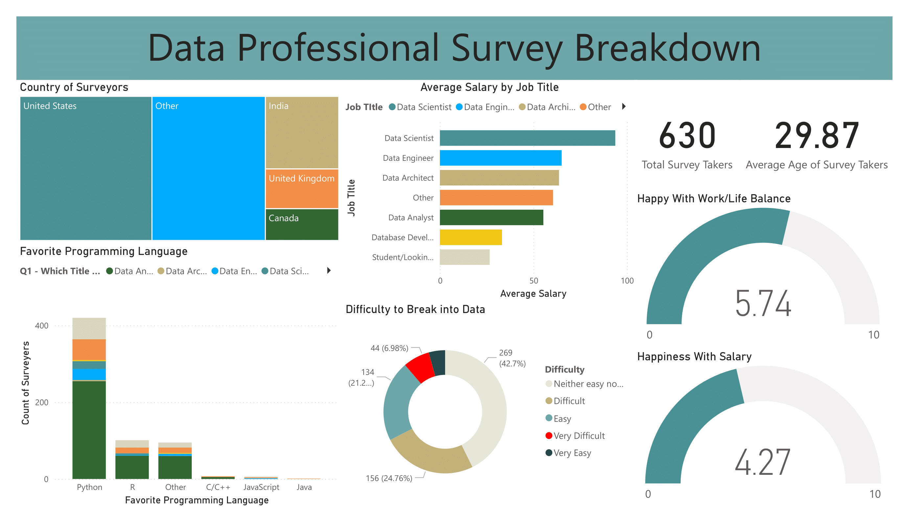

# Data Professional Survey Dashboard

This repository contains all the files and documentation for the **Data Professional Survey Dashboard**, a project analyzing survey responses from over 600 participants in the data industry. The dashboard was created using Power BI and provides insights into salaries, demographics, and job satisfaction.

---

## Dashboard Preview
Here is a preview of the dashboard:



## Table of Contents
- [Overview](#overview)
- [Features](#features)
- [Data Sources](#data-sources)
- [Technologies Used](#technologies-used)
- [File Structure](#file-structure)
- [How to Use](#how-to-use)

---

## Overview

This project involved:
- Cleaning and preparing the survey data (e.g., removing duplicates, handling discrepancies).
- Calculating metrics like average salaries and job satisfaction using DAX in Power BI.
- Building a dashboard to display insights such as:
  - Average salary by job title
  - Demographic breakdown by country
  - Favorite programming languages
  - Difficulty of breaking into the field
  - Work-life balance and salary satisfaction scores

## Features
- Interactive Power BI dashboard showcasing survey insights.
- Visualizations for demographic and salary breakdowns.
- DAX formulas for advanced calculations like averages and weighted metrics.

## Data Sources
The survey data was sourced from:
- **Data Set**: From youtube tutorial - https://www.youtube.com/watch?v=pixlHHe_lNQ&list=PLUaB-1hjhk8HqnmK0gQhfmIdCbxwoAoys&index=9
- **Cleaning Steps**: Handled within Power BI, including:
  - Removing duplicates
  - Rectifying column discrepancies
  - Calculating salary averages

## Technologies Used
- **Power BI**: For cleaning, transforming, and visualizing the data.
- **DAX (Data Analysis Expressions)**: For calculations in Power BI.
- **GitHub**: For version control and collaboration.

## File Structure
```
Data-Professional-Survey/
│
├── data/
│   ├── raw file.csv          # Original raw data file
│   ├── cleaned_data.csv      # Cleaned data after processing in Power BI
│
├── dashboard/
│   ├── Data_Professional_Survey_Project.pbix  # Power BI file with the dashboard
│   ├── Data_Professional_Survey_Project.pdf   # pdf of the Dashboard
│   ├── Data_Professional_Survey_Project.png   # png image of the Dashboard
├── README.md                 # Project overview and instructions
```


## How to Use
1. Clone this repository:
   ```bash
   git clone https://github.com/yourusername/Data-Professional-Survey.git
